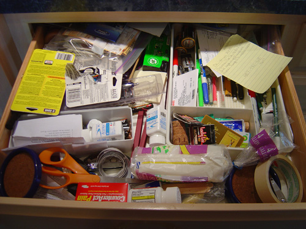

# [fit] Rails and React

---

# About Me

---

^ Back End Instructor at The Iron Yard

---

^ I have promised my girlfriend that I would include a photo of our dog Riley in each presentation I do.

^ I am the Backend Instructor here at The Iron Yard.

---

# Disclaimer

^ I have not used this in production, EVAR

---

## React - Why

`React` is a `JavaScript` library for creating user interfaces by Facebook and Instagram.

Many people choose to think of React as the `V` in `MVC`.

We _[Facebook]_ built React to solve one problem: building large applications with data that changes over time.

---

## MVC & Rails

> Opinion: The V in Rails' MVC is my least favorite thing
-- Gavin Stark

---

## MVC in Rails

Things that help:
- HAML instead of ERB
- Rails partials
- Presenters
- Cells

---

## MVC in Rails

> Opinion: These are all approaches to fix a fundamental issue.

---

## MVC in Rails

> Opinion: The `V` in MVC seems like the proverbial junk drawer

---

## MVC in Rails

> The `V` in MVC in the Rails world is lacking a good framework.

---

# Opinion: Most front end frameworks control *too much* of your app

-
-

# _often all of it_

---

## Why I like React

> (disclaimer, I haven't built a production app in it)

- Doesn't take over the entire app
- Can build individual UI components
- Unidirectional data flow
- Creates a mapping between data and interface
- Data, behavior, and HTML structure are structured in components

---

## Codepen demo

https://codepen.io/anon/pen/xEKpAo

https://codepen.io/gstark/full/YGKYok/

---

# Rails and Reacts

---

# Setup

- Checkout github repository

---

# Review existing app

- Renders list of articles using Ruby iteration
- Would like to add a dynamic search
- Lets reimplement this as a React component

---

# Add React setup for Rails

- add: `gem "react-rails"` to Gemfile
- `bundle install`
- `rails g react:install`

^ Builds in `Babel` for transpiling of JSX, ES6, etc.

^ Builds in support for .js.jsx templates

^ Builds in rails helpers for generating react components and initializing them

^ Builds in server-side rendering of React components into javascript

---
